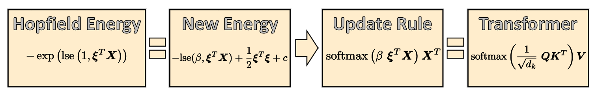
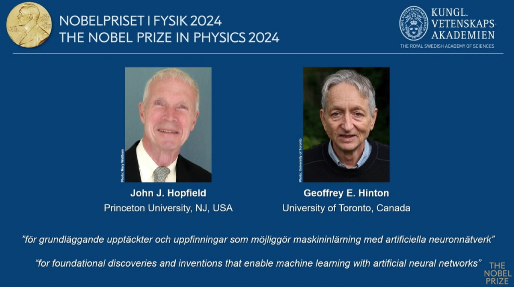

# My Blog

> Will and understanding are one and the same.
> 
> —Baruch Spinoza in _Ethica, ordine geometrico demonstrata_

My blog currently mainly consists of paper and sometimes book reports, which mostly cover machine learning related publications.
These are short articles meant to give a precise but condensed overview over the paper (so more than a TLDR or an abstract).
The covered papers are not necessarily super new nor does my selection necessarily
follow any specific criterion. I mainly write these on occasion to aid my own reading. Since I work on this page regularly, there will often
be articles that are unfinished, consider everything you see work in progress. 

I also have a section where I write shorter reports on very recent and much discussed papers.

Additionally this page functions as a secondary archive for my Machine Learning Reading Group in which we present research papers to one another.

If you scroll all the way down there is also a section with
miscellaneous articles.

## Table of Contents
- [Reading Group Recordings](#reading-group-recordings)
- [Paper Reports](#paper-reports)
- [Paper of the Week](#paper-of-the-week)
- [Miscellaneous](#miscellaneous)

## Reading Group Recordings

### Paper Presentation 3: One-Shot Machine Unlearning with Mnemonic Code
Machine Unlearning is about making a model forget about specific data it saw during training. While this is key for privacy and security
issues, many approaches are computationally intensive. The authors present a very efficient approach that uses Fisher Information to identify
the parameters that are most impactful for forgetting the target data.

**Paper**: [https://arxiv.org/pdf/2306.05670](https://arxiv.org/pdf/2306.05670)

**Slides**:

**Recording**: [https://www.youtube.com/watch?v=caP30Kq-_ME](https://www.youtube.com/watch?v=caP30Kq-_ME)

### Paper Presentation 2: LanguageBind: Extending Video-Language Pretraining to N-modality by Language-based Semantic Alignment
LanguageBind shows how VLMs can be extended to more than two modalities by using language as the bind.

**Paper**: [https://arxiv.org/pdf/2310.01852](https://arxiv.org/pdf/2310.01852)

No slides or recording available

### Paper Presentation 1: Accurate predictions on small data with a tabular foundation model
The authors present TabPFN, a generative transformer-based foundation model for tabular datasets with up to 10k samples, that outperforms the
SOTA gradient-boosted decision tree models like XGboost.

**Paper**: [https://www.nature.com/articles/s41586-024-08328-6#auth-Frank-Hutter-Aff1-Aff3-Aff6](https://www.nature.com/articles/s41586-024-08328-6#auth-Frank-Hutter-Aff1-Aff3-Aff6)

**Slides**:

No recording available

## Paper Reports

> A method is more important than a discovery, since the right method will lead to new and even more important discoveries.
> 
> —Lev Landau

### Paper Report 10: NeRF: Representing Scenes as Neural Radiance Fields for View Synthesis

NeRF is a key paper in 3D Computer Vision from 2020. It lead to a lot of subsequent research in view synthesis up until today.
[read more](paper_report_10.md)

### Paper Report 9: Siamese Neural Networks for One-shot Image Recognition

This is an older paper (from 2015), presenting an early study on metric learning for one shot image classification via the
use of a Siamese Network. There is a reimplementation on my github which this report is
meant to accompany ([One-Shot-Image-Recognition](https://github.com/QuantumSpinozist/One-Shot-Image-Recognition)).
[read more](paper_report_9.md)

### Paper Report 8: Segment Anything

Segment Anything is a large vision foundation model specializing on segmentation.
The project also employs an extensive data annotation procedure to create the largest segmentation
dataset to date.
[read more](paper_report_8.md)

### Paper Report 7: Masked Autoencoders Are Scalable Vision Learners

This paper presents a simple and highly effective way of learning visual representations under self-supervision. The authors present masked autoencoder (MAE) to achieve this.
[read more](paper_report_7.md)

### Paper Report 6: An Image is Worth 16x16 Words: Transformers for Image Recognition at Scale

This is another classic paper, which marks the real beginning of Vision Transformers (ViT). While Transformers are not
as uncontested in Computer Vision as they are in NLP (especially for applications with low inference time requirements like autonomous driving),
they definetely outperform CNNs in many domains. This paper lays out the basic blueprint procedure for how to teach transformers to see.
[read more](paper_report_6.md)

### Paper Report 5: DeepPose: Human Pose Estimation via Deep Neural Networks

DeepPose is a classic paper for Human Pose Estimation. It was one of the earliest for using Deep Learning in the context of Pose Estimation.
The method is very straightforward and simple which makes it a very enjoyable read.
[read more](paper_report_5.md)

### Paper Report 4: Hopfield Networks is all you need

I wanted to write about this paper for quite some time. Even though the general findings of it are quite well known, 
namely that Hopfield networks (when generalized to continous values) are essentially equivalent to the attention mechanism used in transformers,
I still found that there are many people who are not aware of this fascinating result. In light of the nobel prize in physics being awarded to John Hopfield
it felt even more necessary to celebrate this interesting model architecture a bit.
[read more](paper_report_4.md)

### Book Report: The Principles of Deep Learning Theory - Part 2, Learning 

[read more](book_report_roberts_p2.md)

### Book Report: The Principles of Deep Learning Theory - Part 1, Neural Networks at Initialization

I recently finished reading "The Principles of Deep Learning Theory: An Effective Theory Approach to Understanding Neural Networks" by Roberts and Yaida.
The book uses tools from statistical mechanics and field theory as an holistic approach to Deep Learning theory. As my original background is in theoretical physics (specifically theoretical statistical physics)
this was highly intriguing to me. The field of Deep Learning theory is really just in its infancy and there is a lot of research coming in from different angles, using different theoretical and experimental tools.
The books style is one interesting addition to this mix.

The book does not make this explicit but it can be split into two parts relatively nicely. The first part studies MLPs with weights at gaussian initialization, while the second part deals with learning.
I will write one article per part.
[read more](book_report_roberts_p1.md)

### Paper Report 3: Auto-Encoding Variational Bayes

I would like to cover some classic papers in this series, starting with the discovery (or invention, whichever you prefer) of the Variational Autoencoder by Diederik P. Kingma and Max Welling in 2013.
[read more](paper_report_3.md)

### Paper Report 2: Hybrid Active Learning via Deep Clustering for Video Action Detection

This paper presents a novel active learning method designed to drastically reduce the number of annotated frames required for video action detection.
[read more](paper_report_2.md)

### Paper Report 1: Does Knowledge Distillation Really Work?

I want to start writing small reports on papers I have recently read (not necessarily new ones). The purpose is twofold: first, it will help me organize my thoughts, and ideally (if I stick to it), provide a nice overview of interesting articles. More importantly, I’ve noticed that I engage with papers in a much more meaningful way when I have an actual task connected to my reading, like writing a short summary.

I don't aim to report on every paper I read, or even necessarily the ones I enjoyed the most—just the ones that made an impression on me for whatever reason. These reports will mostly summarize the articles, but I also want to include my own commentary and reflections where relevant.
[read more](paper_report_1.md)

## Very Recent Papers

### GSM-Symbolic: Understanding the Limitations of Mathematical Reasoning in Large Language Models
[read more](20_10_24.md)

### Differential Transformer
Inspired by techniques from signal processing the authors introduce differential attention, in which the regular attention output is instead calculated as the difference between two independent attention maps. The idea is that, similar to noise cancellation in headphones, this cancels out noise in the attention pattern, ensuring attention is primarily allocated to relevant context.
[read more](13_10_24.md)

### Were RNNs All We Needed?
This paper asks whether we can make RNN architectures competetive with the zoo of transformer alternatives (Mamba and friends) by modifying
them to be trainable in parallel (like said zoo).
[read more](6_10_24.md)

## Miscellaneous

### Some thoughts on the 2024 Nobel prize in physics

As most people probably know the Nobel prize in physics was awarded to Hinton and Hopfield this year. This has sparked quite some controversy in both the physics and
the machine learning community. As someone with a background in statistical physics who is currently in the process of getting a graduate degree in machine learning, I feel like
I am in a somewhat unique position to comment on this. This short article is not supposed to give any definitive answer to the question whether or not the commitees decision was justified,
I just want to present my thoughts in a structured manner.
[read more](nobel2024.md)

### The Bean Problem - A probabilistic Shower Thought
This is perhaps a rather strange entry but I recently stumbled upon a little exercise in probability theory while cooking.
[read more](bean_problem.md)
